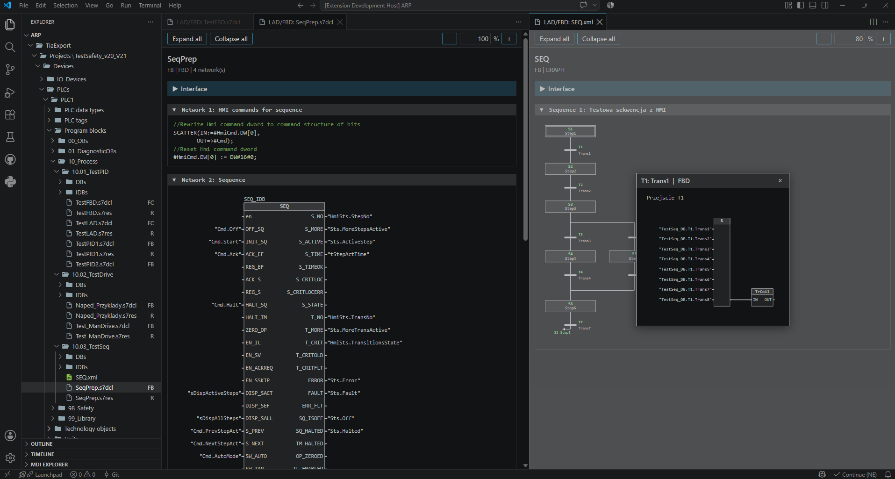
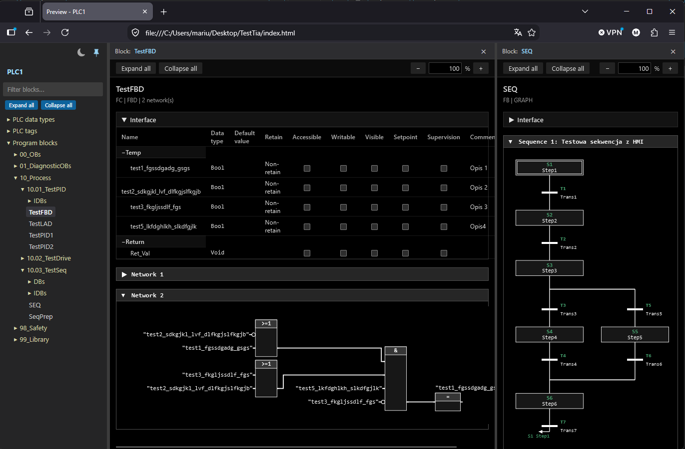
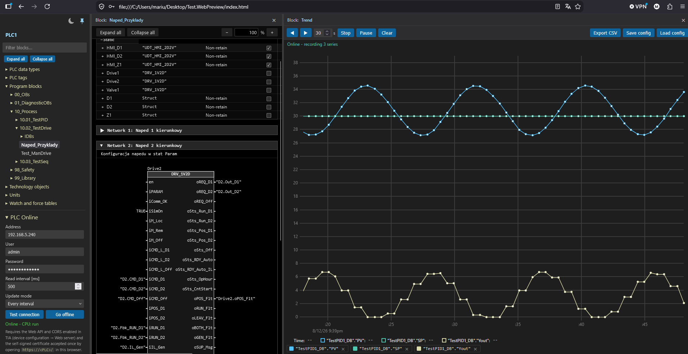

# TIA Viewer and Web Generator

<!-- VERSION-BADGE -->
[](package.json)
<!-- /VERSION-BADGE -->

[](https://code.visualstudio.com/)
[](LICENSE)
[](https://www.microsoft.com/windows)
[](https://www.linkedin.com/in/mariusz-czyrnek-a33b87a6)
[](https://www.paypal.com/donate/?hosted_button_id=68KF5N2K5QQVY)

**Graphical viewer for Siemens TIA Portal PLC exports** — renders LAD/FBD networks, SCL/STL sources, GRAPH sequential function charts, data blocks, PLC data types and tag tables as readable HTML directly inside VS Code or as standalone HTML files. TIA software web preview generator for rewiew software in the web browser and analyse online data.

Designed to cooperate with the [TIA Portal Import](https://github.com/cmariusz/TiaImportExport.VSExt) extension, which produces the export folder structure this viewer understands (`Program blocks`, `PLC data types`, `PLC tags`) — but any TIA Portal XML/SD export dropped into your workspace works.

> 💡 **Tip:** Install the companion **[TIA Portal Import](https://marketplace.visualstudio.com/items?itemName=MariuszCzyrnek.tia-import)** extension to connect VS Code directly to TIA Portal: export blocks, tag tables and UDTs straight into your workspace (`TiaExport/...`), then view them here with one right-click — no manual exporting, no intermediate tools. The two extensions are built to work together.

If this extension helps your TIA Portal workflow, you can support ongoing development with a voluntary [PayPal donation](https://www.paypal.com/donate/?hosted_button_id=68KF5N2K5QQVY).



---

## Key Features

### Built-in LAD / FBD / SCL / GRAPH viewer

| Capability                          | Description                                                                                                                                                                                                                                                                                                                                                                                                                                                                                                                                                                                                                                                                                                                |
| ----------------------------------- | -------------------------------------------------------------------------------------------------------------------------------------------------------------------------------------------------------------------------------------------------------------------------------------------------------------------------------------------------------------------------------------------------------------------------------------------------------------------------------------------------------------------------------------------------------------------------------------------------------------------------------------------------------------------------------------------------------------------------- |
| **Graphical preview LAD/FBD** | Render local program blocks as**interactive network diagrams** directly in a VS Code panel — no TIA Portal connection and **no external tools required**. Reads SimaticML **XML**, **`.s7dcl` + `.s7res`** source documents, **`.scl`** / **`.db`** / **`.udt`** sources and renders LAD rungs with power rail / contacts / coils / parallel branches, FBD boxes and call instances with named pins, syntax-highlighted SCL and STL (including ST inserts mixed into LAD/FBD blocks), and **GRAPH** sequential function charts as TIA-like flowcharts (steps, transitions, alternative/simultaneous branches, jumps) — all following the active VS Code theme. |
| **Interface table**           | TIA-style block interface (Input / Output / InOut / Static / Temp / Constant with retain, HMI flags and comments), collapsible, with**resizable columns**. UDT-typed members are expanded from sibling exports under `PLC data types`.                                                                                                                                                                                                                                                                                                                                                                                                                                                                             |
| **Operand & pin tooltips**    | Global operands show their PLC tag comment on hover (from`PLC tags` tables), call-box pins show the called block's pin comment, interface operands show the interface comment.                                                                                                                                                                                                                                                                                                                                                                                                                                                                                                                                           |
| **GRAPH popups**              | Clicking a transition opens its LAD/FBD logic network; clicking a step opens its action table (Interlock / Event / Qualifier / Action); hovering shows step/transition comments. While online, the active step is highlighted green and the transition popup shows live criteria bits (CRIT) with per-operand TRUE/FALSE states.                                                                                                                                                                                                                                                                           |
| **Failsafe styling**          | F-FBD / F-LAD blocks render with yellow wires and part outlines, like the TIA safety editor.                                                                                                                                                                                                                                                                                                                                                                                                                                                                                                                                                                                                                               |
| **Navigation**                | Right-click a call box →**Open block** opens the called FB/FC in the viewer; **Go to Source Line** jumps to the exact source line of a network or part. Ctrl+wheel zoom / pan / fit-width in the toolbar.                                                                                                                                                                                                                                                                                                                                                                                                                                                                                                     |
| **Classic DB sources**        | Classic non-optimized`.db` sources (`DATA_BLOCK "..."`, including a whole-body anonymous `STRUCT`) render as a flat, expanded interface table.                                                                                                                                                                                                                                                                                                                                                                                                                                                                                                                                                                       |

### HTML Previews (standalone files)

| Capability                           | Description                                                                                                                                                                                                                                                                                                                                                                                                                                                                                                                                                                                                                                  |
| ------------------------------------ | -------------------------------------------------------------------------------------------------------------------------------------------------------------------------------------------------------------------------------------------------------------------------------------------------------------------------------------------------------------------------------------------------------------------------------------------------------------------------------------------------------------------------------------------------------------------------------------------------------------------------------------------- |
| **Generate HTML preview file** | Right-click a block source (`.xml` / `.s7dcl` / `.db` / `.scl` / `.udt`) → writes `<file>.preview.html` next to the source. Fully self-contained (styles + scripts embedded), opens in any browser. Call boxes become links to the previews of called blocks when they sit next to the source.                                                                                                                                                                                                                                                                                                                                  |
| **Whole-PLC Web Preview**      | Right-click a PLC folder →**Generate Web Preview** → pick the output folder. Every block under `Program blocks` / `PLC data types` and every tag table under `PLC tags` (`.xlsx` / `.xml`, sorted by PLC address) becomes a standalone HTML page in a mirror folder tree, tied together by a self-contained `index.html` navigator: collapsible sidebar tree mirroring the TIA folder structure, block filter, split view for comparing two blocks, dark/light theme and cross-block navigation links. The viewer CSS/JS is shared from a single `_assets/` copy, so even ~1200-block PLCs stay compact and open fast. |

---

## Requirements

| Requirement       | Version                                            |
| ----------------- | -------------------------------------------------- |
| **OS**      | Windows 10 / 11                                    |
| **.NET**    | .NET Framework 4.8 (preinstalled on Windows 10/11) |
| **VS Code** | ≥ 1.95.0                                          |
| **Node.js** | 20+ (for building / packaging only)                |

> **No TIA Portal required.** The viewer reads export files from disk only. Use the [TIA Portal Import](https://github.com/cmariusz/TiaImportExport.VSExt) extension (or TIA Portal's built-in export) to produce the files.

---

## Installation

1. Install the extension from VS Code Marketplace (or `code --install-extension MariuszCzyrnek.tia-viewer`)
2. **Recommended:** install the companion **[TIA Portal Import](https://marketplace.visualstudio.com/items?itemName=MariuszCzyrnek.tia-import)** extension (`code --install-extension MariuszCzyrnek.tia-import`) to export PLC programs directly from TIA Portal into your workspace
3. Open a workspace containing TIA Portal exports (e.g. a `TiaExport/Projects/...` tree created by TIA Portal Import)
4. Double-click a block file in the Explorer (or right-click it / a PLC folder and pick a preview command)

---

## Usage

### Previewing a block (interactive webview)

Double-click (or single-click preview) a SimaticML **XML** block, a **`.s7dcl`** source document (the matching `.s7res` is picked up automatically), or a **`.scl`** / **`.db`** / **`.udt`** source in the VS Code Explorer — the graphical viewer is the default editor for these file types. Alternatively, right-click the file and choose **Graphical preview LAD/FBD**. XML files that are not TIA Portal exports still open in the regular text editor, and for any supported file the source can be opened as text via right-click → **Open source file** (or **Open With...** → **Text Editor**).

The viewer renders the block interface (resizable, collapsible columns), LAD rungs, FBD networks, syntax-highlighted SCL/STL and GRAPH sequence flowcharts — all following the active VS Code theme. Networks and the interface panel are collapsible (including Expand all / Collapse all), operand labels and call-box pins show comments as tooltips, and Ctrl+wheel zoom / pan / fit-width are available in the toolbar. In a GRAPH flowchart, clicking a transition opens a popup with its LAD/FBD logic network, clicking a step opens its action table, and hovering a step or a transition shows its comment.

Right-click inside the preview for **Open block** (on a call box) and **Go to Source Line** (on networks and parts).

### Generating a standalone HTML preview file

1. Right-click one or more block sources (`.xml` / `.s7dcl` / `.db` / `.scl` / `.udt`).
2. Choose **Generate HTML preview file**.
3. The preview is written as `<source-file>.preview.html` next to the source; the notification offers an **Open File** button.

### Generating a whole-PLC web preview

1. In VS Code Explorer, right-click the **PLC folder** (the one containing `Program blocks` / `PLC data types` / `PLC tags`).
2. Choose **Generate Web Preview** and pick the output folder in the dialog.
3. Open the generated `index.html` in a browser (the notification offers an **Open Preview** button).

Every block source under `Program blocks` and `PLC data types` is rendered into a mirror folder tree of standalone previews (with clickable cross-block navigation links), and every tag table under `PLC tags` gets a table page sorted by PLC address. The `index.html` navigator provides a collapsible sidebar tree mirroring the TIA folder structure, a block filter, expand/collapse all, a split view for comparing two blocks side by side and a dark/light theme toggle. The viewer CSS/JS is written once to `_assets/` and shared by all pages, so the output stays compact even for large PLCs.



#### PLC Online (live values)

The navigator sidebar contains a collapsible **PLC Online** panel that connects the preview directly to a SIMATIC S7 CPU (S7-1500 / S7-1200 G2) through its built-in web server (JSON-RPC API — see `.github/SimaticWebApi.md`):

1. Expand **PLC Online**, enter the CPU **address**, a **user** and **password** (a user with read access configured in TIA User Management; the password is kept in memory only, never persisted).
2. Pick the **read interval** (ms) and the **update mode** — *Every interval* rewrites all values each cycle, *Only on change* updates the table only when a value actually changes.
3. Press **Test connection** to verify HTTPS reachability and the credentials without going online (the status line reports the result and the CPU operating mode, or a missing-permissions hint).
4. Press **Go online**. The status line shows the connection state and the CPU operating mode (run/stop). Press **Go offline** to disconnect and log out.

While online, opening a **watch table** from the tree shows a **Monitor value** column with live values of the watched tags, refreshed at the configured interval.

The same live monitoring works on **data block pages** (global DBs and instance DBs, including technology object instance DBs): the interface table gains a **Monitor value** column right after the variable name. Only variables with the **Accessible from HMI/OPC UA** attribute (`ExternalAccessible`) are monitored — the flag is inherited down the member tree, so expanding a struct, UDT or multi-instance FB reveals live values for its elements. Arrays of elementary types are monitored per element (`"DB"."arr"[0]`; arrays over 256 elements, arrays of Struct/UDT and whole structs cannot be read through the web API — use a watch table for those). The attribute flags shown in the expanded rows are filled in from the UDT/FB type export when the DB export omits them.

**FB pages** monitor the data of a picked instance instead: an **Instance** selector in the toolbar lists the block's instance DBs and multi-instance paths, the interface table gains the same **Monitor value** column (paths relative to the picked instance) and network operand labels get live values next to them. On **GRAPH** function blocks the flowchart itself goes online too: the currently active step is highlighted **green** (the step's `X` flag), and a transition popup shows the transition's criteria bits — the `CRIT` value (hex + decimal) plus a **TRUE** (green) / **FALSE** (blue) state under every condition operand, decoded from the single polled `CRIT` value (bit N = N-th condition operand; the operand variables themselves are not read). The same online view is available in the VS Code graphical preview panel (PLC Online panel on the right side of the preview).

Prerequisites on the PLC/TIA side: the web server must be enabled on the CPU, **CORS must be allowed** in the web server settings, and — because S7 CPUs use a self-signed certificate by default — open `https://<cpu-address>/` in the browser once and accept the certificate exception before going online.

#### Online trend chart

While online, right-click any monitored variable row on a data block page and choose **Add to chart** to open a live trend in the split view (uPlot-based, up to 10 series, BOOL charted as 0/1). The menu also lets you assign the series to an existing Y axis or create a **New Y axis** for it (up to 5 axes; extras stack on the right with their own scale, and disappear when their last series is removed). The chart records a timestamped sample on every poll and keeps a ring buffer trimmed to the **Max recording time** from the **Trend** panel in the navigator sidebar (default 10 min — retention only; the panel also has an **Open chart** button). The visible time window auto-scrolls with the live edge and is set independently on the chart toolbar (default 30 s, clamped to the retention); pan back with **◀** **▶** to freeze it (recording continues) and press **Follow** to re-attach. Drag-select a range on the chart to zoom into it (the window field shows the dragged span); double-click returns to live follow. Hover the chart for cursor values in the legend; click a legend label to hide/show a series (ctrl-click isolates it). The toolbar also offers pause (redraws only), clear, CSV export and saving/loading the chart configuration as JSON.



#### Copilot tools (PLC online)

While a preview panel is online, GitHub Copilot (agent mode / chat participants) can access the PLC through the extension's language model tools — they reuse the panel's online session and never ask for credentials:

| Tool                  | Reference       | Description                                                                                                                                      |
| --------------------- | --------------- | ------------------------------------------------------------------------------------------------------------------------------------------------ |
| PLC Online Sessions   | `#plcSessions`  | List the PLCs with an active online session (host, web API user).                                                                                |
| Read PLC Variables    | `#plcRead`      | Read online values of variables (`"DB"."Member"…` paths, PLC tags). Requires **Accessible from HMI/OPC UA** on DB members.                        |
| Write PLC Variable    | `#plcWrite`     | Write one online variable (`PlcProgram.Write`). Requires **Writable from HMI/OPC UA**; every write is confirmed by you (see the setting below).    |
| Trend Data            | `#plcTrendData` | List/read the archived trend series, and start/stop **autonomous recording** (`action: "record"`/`"clear"`) — no chart interaction needed.        |

The Accessible/Writable attributes are verified against the exported block sources in the workspace (found anywhere — `Program blocks`, `Units/<unit>`, `Technology objects` or loose PLC folders) with the same inheritance rules as the interface table. This enables agentic workflows such as PID tuning: Copilot records the controller's setpoint / process value / output into the trend, reads the step response, writes adjusted parameters and repeats — you only go online once and confirm the writes. Writes are confirmed per call unless you enable `tiaViewer.lmTools.autoConfirmPlcWrites` (use only in safe setups — writing to a running PLC affects the controlled process).

### Supported input formats

| Format                        | Extension               | Description                                                                                                                    |
| ----------------------------- | ----------------------- | ------------------------------------------------------------------------------------------------------------------------------ |
| **SimaticML XML**       | `.xml`                | Standard TIA Portal export — blocks (OB/FB/FC/DB), UDTs, tag tables                                                           |
| **SD source documents** | `.s7dcl` + `.s7res` | SIMATIC Source Documents (TIA Portal V20+) — LAD/FBD graphical source + multilingual comments                                 |
| **SCL source**          | `.scl`                | `FUNCTION_BLOCK` / `FUNCTION` / ... external source — header + VAR sections as interface, body as highlighted source text |
| **Classic DB source**   | `.db`                 | `DATA_BLOCK "..."` source with inline attributes and trailing `//` comments                                                |
| **UDT source**          | `.udt`                | `TYPE ... END_TYPE` source                                                                                                   |
| **Tag tables**          | `.xlsx` / `.xml`    | PLC tag tables (Tags and Constants sheets) — used for whole-PLC previews and operand tooltips                                 |

### Expected folder layout

The viewer works on any single file, but unlocks its full power (UDT expansion, tag tooltips, Open block navigation) when the exports follow the structure produced by TIA Portal Import:

```
<PLC folder>/
├── Program blocks/       # OB / FB / FC / DB exports
├── PLC data types/       # UDT exports
└── PLC tags/             # tag tables (.xlsx / .xml)
```

Sibling folders are located by walking up to 6 parent directories from the viewed file.

---

## Commands

| Command                        | Where                                                                        | Description                                     |
| ------------------------------ | ---------------------------------------------------------------------------- | ----------------------------------------------- |
| `Graphical preview LAD/FBD`  | Explorer right-click on`.xml` / `.s7dcl` / `.db` / `.scl` / `.udt` | Open the block in the interactive viewer panel  |
| `Generate HTML preview file` | Explorer right-click on block source(s)                                      | Write`<file>.preview.html` next to the source |
| `Generate Web Preview`       | Explorer right-click on a PLC folder                                         | Render the whole PLC to a browsable HTML site   |
| `Open block`                 | Preview right-click on a call box                                            | Open the called FB/FC in the viewer             |
| `Go to Source Line`          | Preview right-click on a network / part                                      | Jump to the source line in the editor           |
| `TIA Viewer: Show Logs`      | Command Palette                                                              | Open the extension output channel               |

---

## Architecture

```
┌─────────────────────────────────────────────────────────────┐
│                       VS Code Extension                     │
│                                                             │
│  Commands (preview / web preview / navigation)              │
│       │                                                     │
│  Services Layer: plcLogicViewer (webview panel)             │
│                  htmlPreview (standalone files, block links)│
│                  viewerBridge ── electron-edge-js ──┐       │
└─────────────────────────────────────────────────────┼───────┘
┌─────────────────────────────────────────────────────▼───────┐
│              TiaViewer .NET Library (C#, net48)             │
│                                                             │
│  Parsing/   SimaticML XML · S7 .s7dcl+.s7res · SCL · .db    │
│  Layout/    FBD · LAD network layout engines                │
│  Rendering/ BlockRenderer · StandaloneHtml · GraphSvg ·     │
│             SCL/STL highlighters · TagTableHtml · PlcIndex  │
│                                                             │
│  Entry point: TiaViewer.ViewerConnector.Invoke              │
│  Routes: Ping · ParseBlock · RenderBlock ·                  │
│          RenderStandaloneHtml · RenderPlcIndex ·            │
│          RenderTagTable · GetViewerAssets                   │
└─────────────────────────────────────────────────────────────┘
```

The viewer is implemented as a standalone .NET library, `dotnet/TiaViewer/` (`TiaViewer.dll`), with **no TIA Portal / Siemens dependencies** and **no NuGet packages**. It dual-targets **.NET Framework 4.8** (loaded in-process by the extension through edge-js) and **.NET Standard 2.0** (for reuse in modern .NET applications).

The library parses SimaticML **XML** and S7 **`.s7dcl` + `.s7res`** sources into a shared block model (`TiaViewer.Parsing`), computes FBD/LAD network layouts (`TiaViewer.Layout`) and GRAPH sequence flowcharts (`TiaViewer.Rendering.GraphSvgRenderer`), and renders them to SVG/HTML strings (`TiaViewer.Rendering`), including complete standalone HTML documents with embedded styles and interactivity scripts.

**Reusing the library in other add-ons:**

- **From Node.js / another VS Code extension** — load `TiaViewer.dll` (net48 build) via edge-js and call `TiaViewer.ViewerConnector.Invoke` with one of the string-keyed routes:
  - `ParseBlock` — `{ fileName, text, siblings? }` → the parsed block document (JSON),
  - `RenderBlock` — same + optional `nonce` → complete HTML document (nonce attributes emitted on `<style>`/`<script>` for CSP hosts),
  - `RenderStandaloneHtml` — same → standalone HTML document, no nonce; optional `cssHref`/`jsHref` link external viewer assets instead of embedding them,
  - `RenderPlcIndex` — `{ plcName, sourceDisplay?, previews[] }` → navigator `index.html` / `index.css` / `index.js` for a whole-PLC web preview,
  - `RenderTagTable` — `{ filePath, fileName?, cssHref? }` → standalone preview of a `PLC tags` export (`.xlsx` / SimaticML `.xml`),
  - `GetViewerAssets` — `{}` → the shared viewer CSS/JS bundle for external-asset previews.
- **From a .NET application** — reference the netstandard2.0 build and call the API directly: `BlockSources.Parse(...)` for parsing, `BlockRenderer.RenderBlockContentHtml(...)` for body markup, `StandaloneHtml` for a full document.

---

## Documentation

- [THIRD_PARTY_NOTICES.md](THIRD_PARTY_NOTICES.md) — third-party components and redistribution notes
- [CHANGELOG.md](CHANGELOG.md) — release history

---

## Third-Party Licensing & Redistribution

- This extension code is released under [MIT](LICENSE).
- Third-party notices for the packaged npm components (`electron-edge-js`, `edge-js`, `edge-cs`) are listed in [THIRD_PARTY_NOTICES.md](THIRD_PARTY_NOTICES.md).
- This package contains **no Siemens components** — it neither uses nor redistributes `Siemens.Engineering.*` assemblies, and no TIA Portal installation or license is required to view export files.

---

## Known Issues & Limitations

- **Windows only** — the .NET viewer assembly is loaded through edge-js (`net48`, win32/x64 native binaries)
- **Know-how protected blocks** — protected blocks cannot be exported by TIA Portal, so there is nothing to view

---

## Disclaimer of Liability

The extension is a development and documentation tool. It only reads files and never modifies engineering data.

The author is not liable for any direct or indirect damages, production downtime, data loss, or other consequences resulting from decisions made based on the rendered previews. Users are fully responsible for validating programs in TIA Portal before deployment to real machines, production lines, or safety-related systems.

---

## Community — Share Your Scripts & Ideas

**We encourage you to contribute!** If you have created useful scripts, export samples, or improvements:

1. **Fork** the [TiaViewer.VSExt](https://github.com/cmariusz/TiaViewer.VSExt) repository on GitHub
2. **Open a Pull Request** — your contribution will help the entire TIA Portal + VS Code community

---

## License

[MIT](LICENSE) — Copyright (c) 2026 Mariusz Czyrnek
